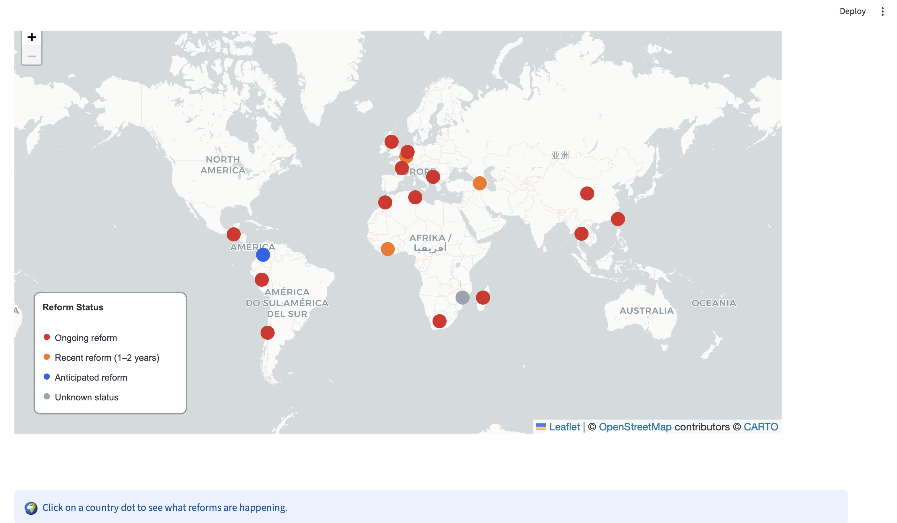
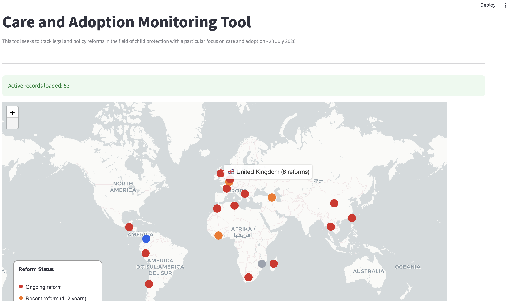
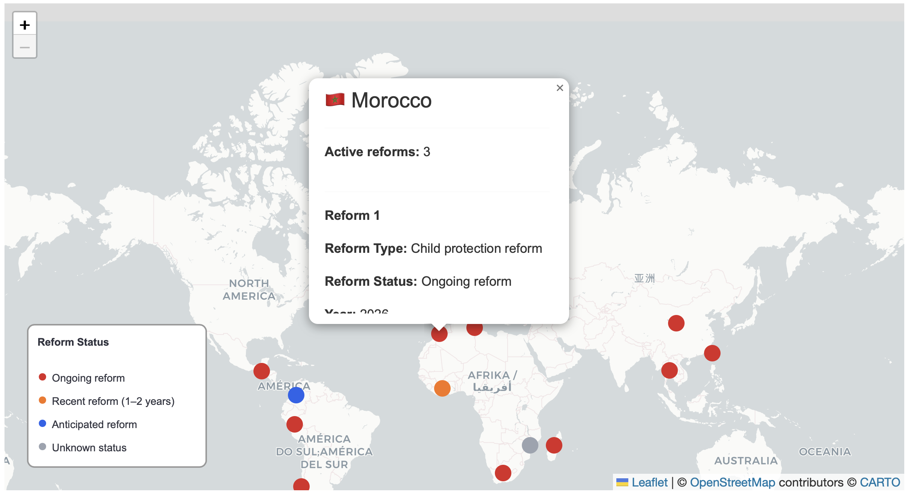
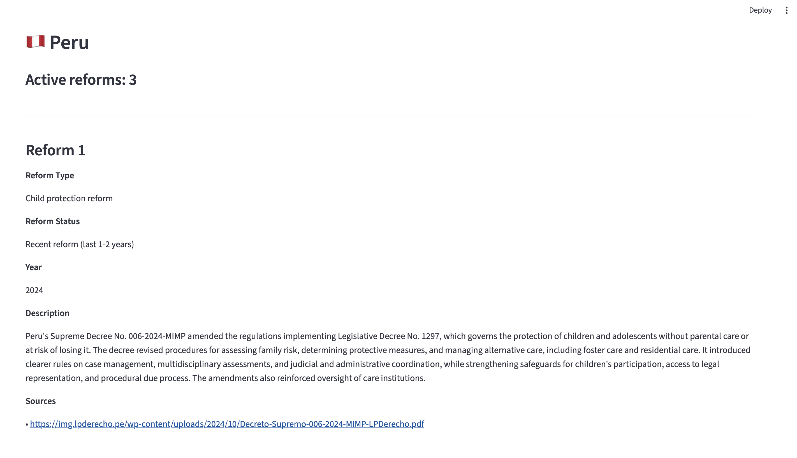

# Child Protection Monitoring Dashboard

## Overview

The Child Protection Monitoring Dashboard is a Streamlit-based prototype developed to support the monitoring of global child protection legal and policy reforms.

The project was developed to address challenges in managing reform monitoring information that was previously stored in an unstructured format. A structured Excel template was created to organise, standardise, and maintain monitoring data, which is then visualised through an interactive dashboard.

## Features

The dashboard provides:

- Interactive world map displaying reform activity by country
- Colour-coded reform status indicators
- Country-level reform profiles
- Reform summaries and source information
- Excel-based data input for future updates

## Technical Approach

The dashboard was developed using:

- Python
- Streamlit
- Pandas
- Folium
- OpenPyXL

The application reads structured monitoring data from an Excel template and transforms it into an interactive web-based dashboard.

## Dashboard Preview

The dashboard provides an interactive view of global child protection legal and policy reforms.

### Interactive World Map

The dashboard displays reform activity by country through an interactive world map with colour-coded reform status indicators.




### Country Hover Information

Hovering over a country displays the country name, flag, and number of active reforms.




### Reform Summary Popup

Clicking on a country marker displays a summary of reform information, including reform type, status, and year.




### Country Profile Dashboard

Selecting a country displays detailed reform information below the map, including reform descriptions and sources.



## Project Structure

```
child-protection-monitoring-dashboard/

├── app.py
├── CAMT - Template.xlsx
├── requirements.txt
├── README.md
└── screenshots/
    ├── world-map.png
    ├── country-hover.png
    ├── country-popup.png
    └── country-profile.png
```

## Running the Dashboard

Install the required Python packages:

```bash
pip install -r requirements.txt
```

Run the application:

```bash
streamlit run app.py
```

The dashboard will open automatically in a web browser.

## Future Development

The current version is a prototype. Potential future developments include:

- Deployment through an online platform
- User authentication and access controls
- Automated data updates
- Integration with additional monitoring systems

## Purpose

This project demonstrates a workflow for transforming unstructured monitoring information into a structured dataset and interactive dashboard to support data analysis, reporting, and decision-making.
